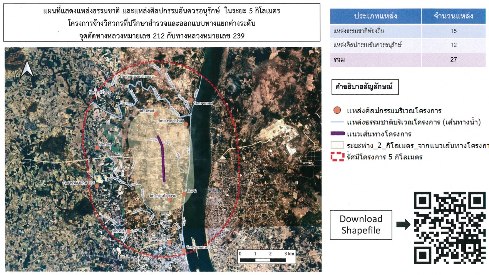

# Spatial Analysis EIA Map Generator

สคริปต์ Python สำหรับสร้างแผนที่วิเคราะห์เชิงพื้นที่ เพื่อประกอบการจัดทำรายงานการประเมินผลกระทบสิ่งแวดล้อม (EIA) โดยแสดงแหล่งธรรมชาติและแหล่งศิลปกรรมอันควรอนุรักษ์ในรัศมีรอบโครงการ

---

## โครงสร้างโฟลเดอร์

```
spatial-analysis-eia/
├── run.py                        # สคริปต์หลัก
├── logo.png                      # โลโก้หน่วยงาน (สผ.)
├── data/
│   ├── โครงการ.gpkg              # ขอบเขต/แนวเส้นทางโครงการ
│   ├── แหล่งน้ำธรรมชาติ.gpkg
│   ├── แหล่งน้ำ.gpkg
│   ├── ผังภูมินิเวศ.gpkg
│   ├── แหล่งมรดกโลก.gpkg
│   ├── แหล่งศิลปกรรม1.gpkg
│   └── แหล่งศิลปกรรม2.gpkg
└── Proj_1.qgz                    # QGIS project file
```

---

## ไลบรารีที่ต้องติดตั้ง

```bash
pip install geopandas matplotlib contextily pandas numpy qrcode pillow
```

| ไลบรารี | การใช้งาน |
|---------|-----------|
| `geopandas` | อ่านและประมวลผลข้อมูล GeoPackage (.gpkg) |
| `matplotlib` | วาดแผนที่และ layout |
| `contextily` | โหลด Satellite basemap (Esri World Imagery) |
| `pandas` | รวม/นับข้อมูล layer |
| `numpy` | แปลง QR Code เป็น array รูปภาพ |
| `qrcode` | สร้าง QR Code |

---

## การทำงานของโค้ด

### 1. ตั้งค่าเริ่มต้น

```python
plt.rcParams["font.family"] = "TH Sarabun New"
plt.rcParams["font.size"] = 16
dir_app = os.path.dirname(os.path.abspath(__file__))
```

กำหนดฟอนต์ภาษาไทย (TH Sarabun New) และ path ของโฟลเดอร์โปรเจกต์

---

### 2. ฟังก์ชันช่วย

```python
def load(name, layer=None):
    return gpd.read_file(...).to_crs(epsg=3857)

def _kind(layer_name):
    ...
```

- **`load()`** — อ่านไฟล์ .gpkg จากโฟลเดอร์ `data/` และแปลง coordinate system เป็น EPSG:3857 (Web Mercator) เพื่อให้ตรงกับ basemap
- **`_kind()`** — อ่านชื่อ layer เพื่อระบุประเภทเรขาคณิต: `point_*` → จุด, `line_*` → เส้น, อื่น ๆ → polygon

---

### 3. กำหนดรายการข้อมูล (`layer_analysis`)

```python
layer_analysis = [
    {"name": ..., "file": ..., "layer": ..., "label": ..., "color": ..., "visible": True, "zIndex": ...},
    ...
]
```

รายการ dict แต่ละตัวกำหนดข้อมูล 1 layer โดยมี field สำคัญ:

| Field | ความหมาย |
|-------|----------|
| `name` | ชื่อ key สำหรับอ้างอิงใน code |
| `file` | ชื่อไฟล์ .gpkg ใน `data/` |
| `layer` | ชื่อ layer ภายในไฟล์ .gpkg |
| `label` | ชื่อที่แสดงในตารางและ legend |
| `color` | สีที่ใช้วาดบนแผนที่ (hex) |
| `visible` | `True` = โหลดและแสดงผล, `False` = ข้าม |
| `zIndex` | ลำดับการซ้อนทับบนแผนที่ (มากกว่า = อยู่บนกว่า) |

---

### 4. โหลดข้อมูล

```python
gdf_project = load("โครงการ.gpkg", layer="โครงการ")
gdf_loads = { item["name"]: load(...) for item in layer_analysis if item["visible"] }
```

โหลดข้อมูลโครงการและ layer วิเคราะห์ทุกตัวที่มี `visible: True` เป็น GeoDataFrame เก็บใน dict `gdf_loads`

---

### 5. สร้าง Buffer รอบโครงการ

```python
buf_m = 2000
project_union = gdf_project.geometry.union_all()
buf_km = project_union.buffer(buf_m)
gdf_buf_km = gpd.GeoDataFrame(geometry=[buf_km], crs=3857)
```

รวม geometry ของโครงการทั้งหมดเป็นชิ้นเดียว แล้วสร้าง buffer รัศมี `buf_m` เมตร (ค่าปัจจุบัน = 2,000 ม. = 2 กม.)

---

### 6. กำหนดขอบเขตแผนที่ (Map Extent)

```python
minx, miny, maxx, maxy = buf_km.bounds
pad = (maxx - minx) * 0.05
ext_x0, ext_x1 = minx - pad, maxx + pad
ext_y0, ext_y1 = miny - pad, maxy + pad
```

คำนวณขอบเขตแผนที่จาก bounding box ของ buffer แล้วเพิ่ม padding 5% รอบด้านเพื่อไม่ให้ข้อมูลชิดขอบ

---

### 7. นับจำนวนแหล่งภายใน Buffer

```python
all_layers = pd.concat([
    gdf_loads[item["name"]][gdf_loads[item["name"]].intersects(buf_km)][["geometry"]].assign(label=item["label"])
    ...
])
category_counts = all_layers.groupby("label").size().sort_values(ascending=False)
```

กรองเฉพาะ feature ที่ตัดกับ buffer แล้วนับจำนวนแต่ละประเภท เพื่อแสดงในตารางสรุป

---

### 8. ตั้งค่า Layout แผนที่

```python
A4_W, A4_H = 10, 6
map_aspect   = (ext_x1 - ext_x0) / (ext_y1 - ext_y0)
map_w_in     = map_aspect * (A4_H * 0.9)
info_w_in    = A4_W - map_w_in

gs = gridspec.GridSpec(2, 2, height_ratios=[0.1, 0.9], width_ratios=[map_w_in, info_w_in], ...)
```

คำนวณสัดส่วน `ax_map` จาก aspect ratio ของแผนที่จริง เพื่อให้ map scale ถูกต้องโดยอัตโนมัติ แบ่ง layout เป็น 3 ส่วน:

| Axes | ตำแหน่ง | เนื้อหา |
|------|---------|---------|
| `ax_title` | บน (เต็มความกว้าง) | ชื่อแผนที่ |
| `ax_map` | ล่างซ้าย | แผนที่ |
| `ax_info` | ล่างขวา | ตาราง + legend + QR + logo |

---

### 9. วาด Map Layers

```python
max_z = max(item["zIndex"] for item in layer_analysis if item["visible"])
gdf_project.plot(..., zorder=max_z + 2)   # แนวเส้นทางโครงการ (บนสุด)
gdf_buf_km.plot(..., zorder=max_z + 1)    # เส้น buffer
for item in layer_analysis:
    gdf_loads[item["name"]].plot(..., zorder=item["zIndex"])  # layer วิเคราะห์
ctx.add_basemap(ax_map, ..., zorder=1)    # Satellite basemap (ล่างสุด)
```

วาด layer จากล่างขึ้นบน โดยใช้ `zIndex` จาก `layer_analysis` โครงการและ buffer ถูกกำหนดให้อยู่บนสุดเสมอ (`max_z + 2` และ `max_z + 1`)

---

### 10. ตารางสรุปจำนวนแหล่ง

```python
table_rows = [("ประเภทแหล่ง", "จำนวนแหล่ง", ...), ...]
for i, (label, value, bg, fg, bold) in enumerate(table_rows):
    ax_info.add_patch(mpatches.Rectangle(...))
    ax_info.text(...)
```

วาดตารางใน `ax_info` แบบ dynamic จากข้อมูล `category_counts` แถวหัวตาราง สีน้ำเงิน แถวข้อมูล สีขาว และแถว "รวม" ที่ด้านล่างสุด

---

### 11. Legend (คำอธิบายสัญลักษณ์)

```python
legend_items = sorted([...], key=lambda x: _kind_order.get(x[0], 99))
row_h_leg = min(0.075, leg_avail / n_leg)   # auto-scale
```

สร้าง legend อัตโนมัติจาก `layer_analysis` เรียงลำดับ Point → Line → Dash → Polygon และ auto-scale ขนาดสัญลักษณ์และตัวอักษรให้พอดีกับพื้นที่ที่เหลืออยู่

---

### 12. QR Code

```python
qr_obj = qr.QRCode(box_size=4, border=1)
qr_obj.add_data("https://www.google.com")
qr_img = np.array(qr_obj.make_image(...).convert("RGB"))
ax_info.imshow(qr_img, extent=[...], clip_on=True)
```

สร้าง QR Code จาก URL และแสดงผลใน `ax_info` โดยใช้ `imshow` กับ `extent` ในหน่วย axes coordinates (0–1) พร้อม `clip_on=True` เพื่อไม่ให้ล้นออกนอกกรอบ

---

### 13. Logo และชื่อหน่วยงาน

```python
logo_img = plt.imread(logo_path)
ax_info.imshow(logo_img, extent=[...], clip_on=True)
ax_info.text(..., "สำนักงานนโยบายและแผน\nทรัพยากรธรรมชาติและสิ่งแวดล้อม (สผ.)", ...)
```

อ่านไฟล์ `logo.png` และแสดงผลใต้ QR Code พร้อมชื่อหน่วยงาน 2 บรรทัด

---

## การปรับแต่ง

| ต้องการปรับ | แก้ที่ |
|------------|--------|
| รัศมี buffer | `buf_m = 2000` (หน่วย: เมตร) |
| เพิ่ม/ลด layer | เพิ่ม/ลบ dict ใน `layer_analysis` |
| ซ่อน layer ชั่วคราว | `"visible": False` |
| เปลี่ยนสี layer | `"color": "#xxxxxx"` |
| เปลี่ยน URL ใน QR | `url_data = "https://..."` |
| เปลี่ยนขนาด output | `A4_W, A4_H = 10, 6` (หน่วย: นิ้ว) |

---

## ตัวอย่างผลลัพธ์


